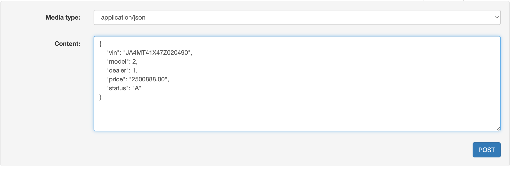
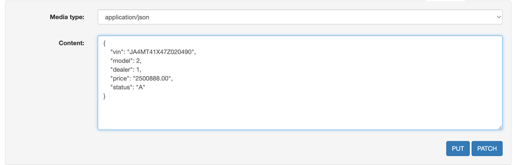
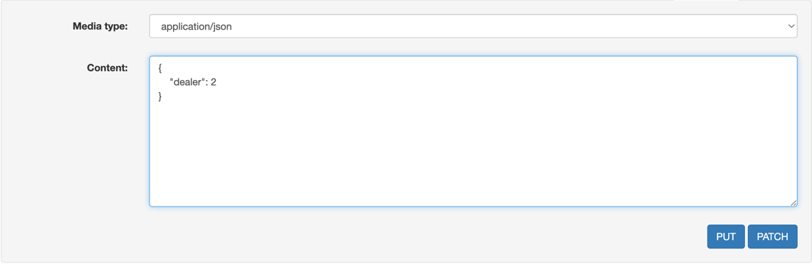
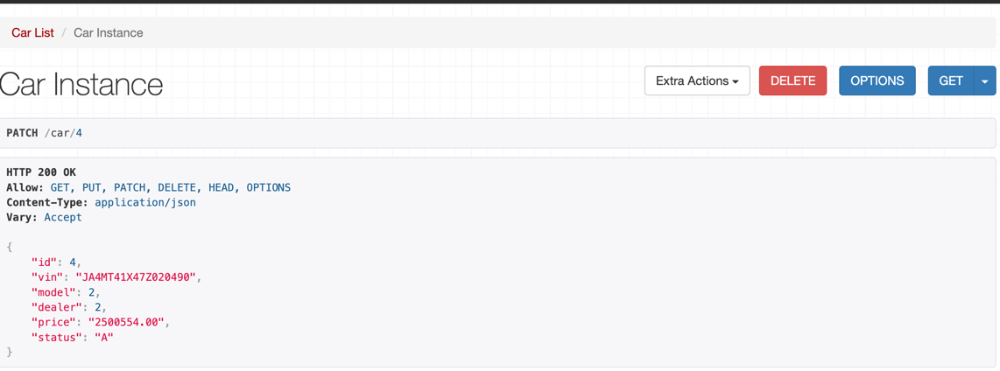

# Automarket  REST API

Проект выполнен в рамках тестового задания. Код проекта написан на языке Python
3.8, с использованием библиотек Django и Django REST framework, зависимости
описаны в requirements.txt.

Проект работает с базой данных sqlite.

Проект представляет REST API сервиса продажи автомобилей автодилерами. Описаны
модели Manufacturer, Dealer, CarModel и Car. Все модели поддерживают операции
создания, чтения, обновления и удаления.

Для запуска сервера необходимо выполнить команду **python manage.py runserver 127.0.0.1:8000**.
Чтобы протестировать API, можно воспользоваться DRF debug tool, который предоставляет удобный GUI. 

Для получения данных о всех экземплярах модели, выполните GET запрос:

`http://127.0.0.1:8000/{model_name}`

Например: _http://127.0.0.1:8000/car_

Для получения данных о конкретном экземпляре, необходимо добавить идентификатор:

`http://127.0.0.1:8000/{model_name}/{id}`

Например: _http://127.0.0.1:8000/car/1_

Для создания экземпляра модели необходимо выполнить POST запрос c URL `http://127.0.0.1:8000/{model_name}`, в теле запроса передать JSON объект

Пример тела запроса:

Для изменения всех данных о конкретном экземпляре необходимо выполнить PUT запрос с URL `http://127.0.0.1:8000/{model_name}/{id}`, в теле запроса передать JSON объект

Для частичного изменения данных об экземпляре необходимо выполнить PATCH запрос с URL h`http://127.0.0.1:8000/{model_name}/{id}`, в теле запроса передать JSON объект

Для удаления экземпляра необходимо выполнить DELETE запрос с URL `http://127.0.0.1:8000/{model_name}/{id}`

Для модели Car реализовано дополнительное действие **sell_car**, устанавливающее статус экземпляра модели `status = STATUS_SOLD`

Выполняется PUT запросом c URL `http://127.0.0.1:8000/{model_name}/{id}/sell_car`

Действие доступно только для экземпляров, доступных для продажи - `status = STATUS_AVAILABLE`
 